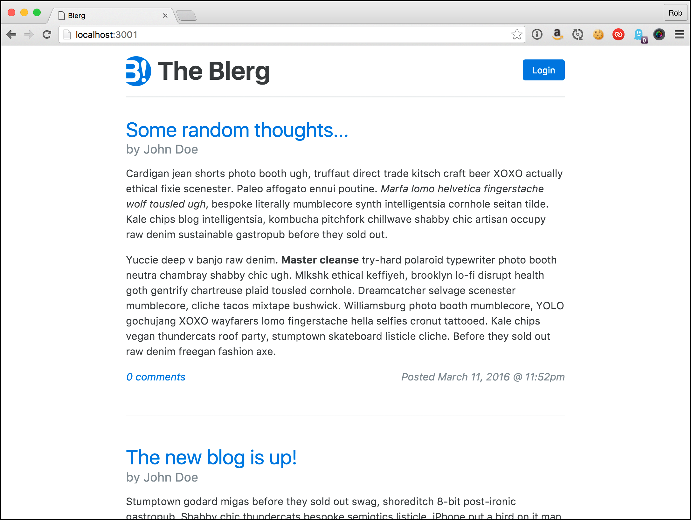
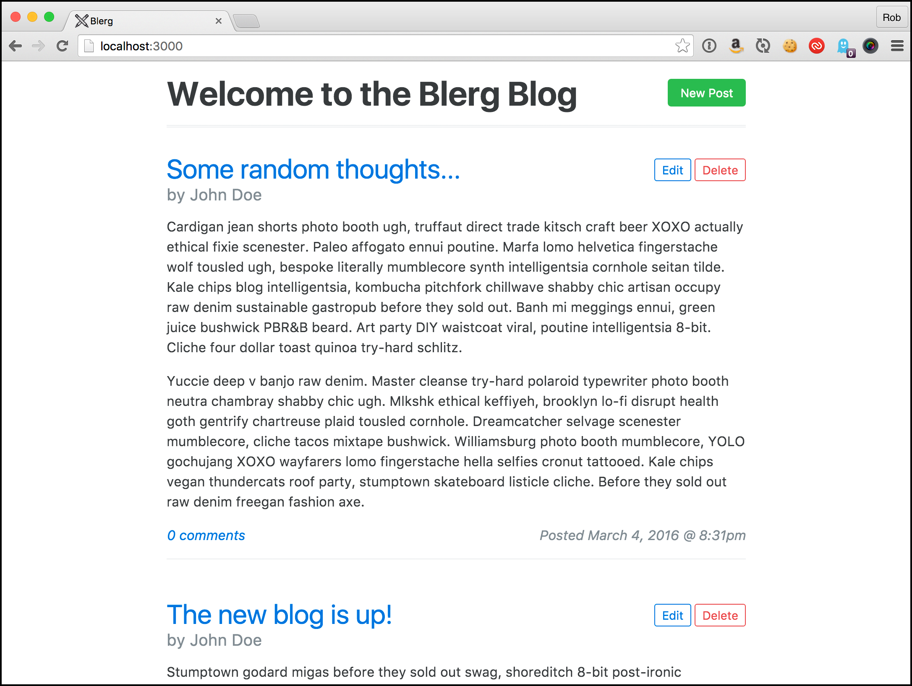

# The Rails App

Seeing as how this is a manual for deploying a Rails app we'll need an app to deploy. Hopefully you have your own ready to go, but just in case I've put a simple one together that will showcase the core set of AWS services a typical web app will need: 

* The app itself (EC2)
* A database (RDS)
* View caching (ElastiCache)
* Background job processing
* Image hosting (S3 and CloudFront)
* Email delivery (SES)

Don't worry about those acronyms yet--we'll talk all about them in the next chapter.

What better way to demonstrate something Rails-related than with a blog! Yes, yet another blog. This one has just enough features that we get to use each of those aforementioned AWS services:

* Posting a blog entry
* Including images in a blog post
* Adding comments
* Receiving an email notification if there are new comments after yours
* Caching of posts and comments to speed page rendering

And what's yet another Rails blog without yet another goofy name: Blerg. Clever, right?

You can get the code for Blerg here: [https://github.com/cannikin/blerg](https://github.com/cannikin/blerg). Throughout this chapter we'll be making various code changes to the app to get it ready for deployment. Fork this repo now and then clone your copy of it. Make sure you commit and push your changes before deploying for the first time or you'll see some spectacular failures.

As we take a tour through the code we'll spot several areas of improvement to get everything ready for production.

I> As of March 2016 the app is written against Rails 5.0.0.beta3. I'll update the code to the production release of Rails 5.0.0 and update the book if needed when the time comes.

{pagebreak}

## Up and running

Blerg has one dependency outside of Ruby and the dependent gems in the `Gemfile`: [ImageMagick](http://www.imagemagick.org/script/index.php). ImageMagick is used to resize images to fit in a blog post. We probably could have gotten away without it in this app (images would just be shrunk to fit) but just about every app I've ever worked on has ended up requiring ImageMagick at some point. Plus it gives us some potential performance tuning experience.

If you're on a Mac you should definitely be using [homebrew](http://brew.sh/) to install your third-party packages. Once you have homebrew installed then getting imagemagick is as simple as:

{linenos=off}
        brew install imagemagick

On a Debian-based system you can use aptitude:

{linenos=off}
        apt-get install imagemagick

(Depending on how your system is set up you may need to prefix that with a `sudo`).

If you install your packages with `yum` then use that instead:

{linenos=off}
        yum install imagemagick

If you're on another system, or Windows, please refer to the ImageMagick site at http://imagemagick.org for instructions on installing on your system.

Okay, let's get to the app. From whatever directory you want to install the code start a `clone`:

{linenos=off}
        git clone git@github.com:cannikin/blerg.git

I> If you followed my recommendation in the last section then you'll want to change that address to your forked copy of Blerg, not my original copy.

Once you've checked out the code you'll want to install the required gems:

{linenos=off}
        bundle install

And create the development database:

{linenos=off}
        bin/rails db:schema:load

If you want to load some sample blog posts and comments then go ahead and seed the database:

{linenos=off}
        bin/rails db:seed

Q> ## What's with `bin/rails`? 
Q>
Q> If you've been developing with Rails for a while you're probably used to seeing `bundle exec` before most `rake` and `rails` commands. `bundler` can create "binstubs" which are the executable files for commands like `rake` and `rails` but pre-configured to include Bundler automatically. So rather than prefacing all commands with `bundle exec` you can use the `bin` versions instead. It's recommended that you commit the bin files to your repo.
Q>
Q> If you don't have any binstubs in your app code you can tell bundler to create them with `bundle install --binstubs`. The deployment scripts we use later in the book assume you have binstubs in your project.

Start the server:

{linenos=off}
        bin/rails s

And head over to http://localhost:3000 to see what we've got:

Watch out Wordpress!

Play around to get a feel for how everything works. You can add a comment without being logged in, but to create a new blog post you'll need to click that **Login** link at the upper right. Email: _owner@blerg.com_ Password: _blerg_

Once logged in you'll get a **New Post** button at the upper right. Click that, fill in the fields and you'll be Blerging in no time. (See what I did there?)

The blog supports Markdown[^markdown] which makes it easy to add some formatting to your posts. For simplicty you can attach a single image to your blog post using the **Add Image** file field. Currently the image is saved locally in carrierwave's[^carrierwave] default location of `public/uploads`.

{pagebreak}

## The code

Let's take a look at some of the code. `config/routes.rb` is usually a good place to start poking around a new app:

    Rails.application.routes.draw do
      resources :posts do
        resources :comments
      end
      controller :sessions do
        get  'login'  => :new
        post 'login'  => :create
        get  'logout' => :destroy
      end
      root :to => 'posts#index'
    end

We've got a resource for posts and a subresource for comments. We have a pseudo-resource for sessions: it has the `new`, `create` and `destroy` endpoints representing the login page, `POST` login and logout. Finally we have the root of the site render the same thing as the `index` action on `posts`.

### Session management

We have a very simple login/logout system comprised of a few methods in `ApplicationController`:

    class ApplicationController < ActionController::Base

      protect_from_forgery with: :exception
      helper_method :logged_in?, :current_user

      def logged_in?
        current_user.present?
      end

      def current_user
        @current_user ||= User.find(session[:user_id]) if session[:user_id]
      end

      def log_in_user(user)
        session[:user_id] = user.id
      end

      def log_out_user
        reset_session
      end

      def require_session
        unless logged_in?
          flash[:error] = 'You must be logged in to do that!'
          redirect_to login_url
        end
      end

    end

This is how I learned to build session handling thanks to the original [Agile Web Development with Rails](https://pragprog.com/book/rails4/agile-web-development-with-rails-4) book and it's how I tend to start all new apps unless the session-handling needs warrant upgrading to something like [Authlogic](https://github.com/binarylogic/authlogic).

Logging someone in means putting their `user.id` in session. Someone is considered logged in if that `session` key is present and a `User` record is found for it. `current_user` is available in controllers and views and returns that found user (if any). Logging someone out means resetting their session, which wipes the `user_id` key from `session`. Finally we have the `require_session` method which can go into a `before_action` to enforce that someone be logged in before accessing a certain action. They're redirected to the login page if not logged in.

### Controllers

The controllers are pretty straight forward--`PostsController` for posts, `CommentsController` for comments and `SessionsController` for login/logout.

### Views

The views are equally as simple. There is a `posts/_post.html.erb` partial which renders a single post. When viewing `posts#show` you'll also see a list of comments. There's a `comments/_comment.html.erb` partial that renders those. `posts/_form.html.erb` is the form for creating a new post and `comments/_form.html.erb` is the form for creating a new comment.

    views
    |
    |- comments
    |  |- _form.html.erb
    |  |- _post.html.erb
    |
    |- posts
    |  |- _form.html.erb
    |  |- _post.html.erb
    |  |- edit.html.erb
    |  |- index.html.erb
    |  |- new.html.erb
    |  |- show.html.erb
    |
    |- sessions
       |- new.html.erb

Do you see any performance improvements that can be made when rendering posts and comments? What happens if a post a dozen comments? What about a _dozen_ dozen? That's a lot of data to grab from the database on every request. This is a place that's ripe for caching.

How about the homepage? There's currently no limit on the number of posts shown. One improvement would be to paginate that homepage. But even if we only showed 10 posts that's still 10 posts worth of data to pull from database on each and every request--especially considering that a post (probably) never changes! It's the same text over and over again.

### Mailers

When leaving a comment you can choose to be notified (via email) if there are any followup comments after yours. That's handled by the `CommentMailer`. Emails are created and delivered by the `CommentController` after a comment has been successfully created:

~~~
    def create
      @comment = Comment.new(comment_params)
      @comment.post = @post

      if @comment.save!
        notify_users
        redirect_to @post, notice: 'Your comment was added!'
      else
        render @post
      end
    end

    private def notify_users
      @post.notify_comments.each do |comment|
        CommentMailer.new_comment(comment).deliver unless comment == @comment
      end
    end
~~~

Assuming the comment is created, we grab all the comments where the owner wanted to be notified and then send an email to them (assuming the comment isn't the one we just created).

If you think about it this is a spot that can create some serious performance problems: what happens if a popular post has a hundred comments? That's potentially 100 emails that need to be created, sent to a mail server, and each will block while waiting for a response from said server. All of that needs to happen before the user sees that their comment has been posted successfully! 

Ideally the page would return as fast as if there were zero notifications to send no matter how many actually need to go out. When we think about deploying to a production environment this is the kind of code that is begging to be improved to keep the user's experience streamlined.

### Uploading

This app uses Carrierwave to handle image uploading and resizing. We resize any uploaded images to twice the width of the site. This makes sure that everything looks nice and sharp on a retina display (2x pixel density). Unfortunately this simple solution means that someone on mobile will need to download an entire 1440px-wide image even though an iPhone 6, for example, only needs an image to be 750px wide for retina.

Here's another area ripe for improvement as we think about going to production.

The app currently saves images in `public/uploads`. This is actually a viable solution if you plan on only having one web server--it can happily serve images from here forever, and pretty quickly, too. However we're going to build a robust production environment including load balanced web servers. If one web server saves the image to its local disk the others behind the LB can't find it without setting up complex disk shares and mounts. 

It's much simpler, and more robust, to get our images onto a content delivery network (CDN) and distributed around the globe for the fastest possible delivery to our users.

### Assets

Nothing out of the ordinary here. We've got a couple SCSS files--[Bootstrap](http://v4-alpha.getbootstrap.com/), one for the login page and one for posts (which covers everything else). The only thing out of the ordinary is the load order in `application.scss`. `bootstrap` contains the framework, then I `require_self` to get the shared styles in `application.scss` set, then `require_tree .` to include everything else.

The app doesn't currently have any custom Javascript, just the defaults of `jquery`, `jquery-rails` and `turbolinks`.

We've got a single image, the logo. Your app may have many more. I'm going to show you a couple of tricks for optimzing these to get them as small as possible for the quickest delivery to end users.

# TODO

* Overview of a simple blogging app
  * Can upload images (to include S3 + CloudFront)
  * memcached
  * delayed job
  * SES
* What state it should be in before we begin
  * Config in environment variables
  * dotenv
  * binstubs
* Github setup, ssh keys
* ruby-install, chruby

[^markdown]: https://github.com/adam-p/markdown-here/wiki/Markdown-Cheatsheet
[^carrierwave]: https://github.com/carrierwaveuploader/carrierwave
