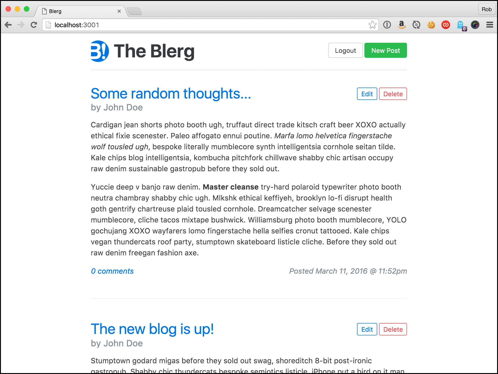

# The Rails App

Seeing as how this is a manual for deploying a Rails app we'll need an app to deploy. Hopefully you have your own ready to go, but just in case I've put a simple one together that will showcase the core set of AWS services a typical web app will need: 

* The app itself (EC2)
* A database (RDS)
* View caching (ElastiCache)
* Background job processing
* Image hosting (S3 and CloudFront)
* Email delivery (SES)

Don't worry about those acronyms yet--we'll talk all about them in the next chapter.

What better way to demonstrate something Rails-related than with a blog! Yes, yet another blog. This one has just enough features that we get to use each of those aforementioned AWS services:

* Posting a blog entry
* Including images in a blog post
* Adding comments
* Receiving an email notification if there are new comments after yours
* Caching of posts and comments to speed page rendering

And what's yet another Rails blog without yet another goofy name: Blerg. Clever, right?

You can get the code for Blerg here: [https://github.com/cannikin/blerg](https://github.com/cannikin/blerg). Throughout this chapter we'll be making various code changes to the app to get it ready for deployment. Fork this repo now and then clone your copy of it. Make sure you commit and push your changes before deploying for the first time or you'll see some spectacular failures.

As we take a tour through the code we'll spot several areas of improvement to get everything ready for production.

I> As of March 2016 the app is written against Rails 5.0.0.beta3. I'll update the code to the production release of Rails 5.0.0 and update the book if needed when the time comes.

{pagebreak}

## Up and running

Once you've checked out the code you'll want to install the required gems:

{linenos=off}{lang="bash"}
        bundle install

And create the development database:

{linenos=off}{lang="bash"}
        bin/rails db:schema:load

If you want to load some sample blog posts and comments then go ahead and seed the database:

{linenos=off}{lang="bash"}
        bin/rails db:seed

Q> ## What's with `bin/rails`? 
Q>
Q> If you've been developing with Rails for a while you're probably used to seeing `bundle exec` before most `rake` and `rails` commands. `bundler` can create "binstubs" which are the executable files for commands like `rake` and `rails` but pre-configured to include Bundler automatically. So rather than prefacing all commands with `bundle exec` you can use the `bin` versions instead. It's recommended that you commit the bin files to your repo.
Q>
Q> If you don't have any binstubs in your app code you can tell bundler to create them with `bundle install --binstubs`. The deployment scripts we use later in the book assume you have binstubs in your project.

Start the server:

{linenos=off}{lang="bash"}
        bin/rails s

And head over to http://localhost:3000 to see what we've got:

Watch out Wordpress!

Play around to get a feel for how everything works. You can add a comment without being logged in, but to create a new blog post you'll need to click that **Login** link at the upper right. Email: _owner@blerg.com_ Password: _blerg_

Once logged in you'll get a **New Post** button at the upper right. Click that, fill in the fields and you'll be Blerging in no time. (See what I did there?)

The blog supports Markdown[^markdown] which makes it easy to add some formatting to your posts. For simplicty you can attach a single image to your blog post using the **Add Image** file field. Currently the image is saved locally in carrierwave's[^carrierwave] default location of `public/uploads`.

{pagebreak}

## The code

Let's take a look at some of the code. `config/routes.rb` is usually a good place to start poking around a new app:

    Rails.application.routes.draw do
      resources :posts do
        resources :comments
      end
      resources :session, :only => [:new, :create, :destroy]

      root :to => 'posts#index'
    end

# TODO

* Overview of a simple blogging app
  * Can upload images (to include S3 + CloudFront)
  * memcached
  * delayed job
  * SES
* What state it should be in before we begin
  * Config in environment variables
  * dotenv
  * binstubs
* Github setup, ssh keys
* ruby-install, chruby

[^markdown]: https://github.com/adam-p/markdown-here/wiki/Markdown-Cheatsheet
[^carrierwave]: https://github.com/carrierwaveuploader/carrierwave
